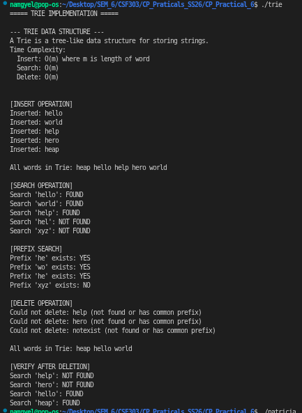
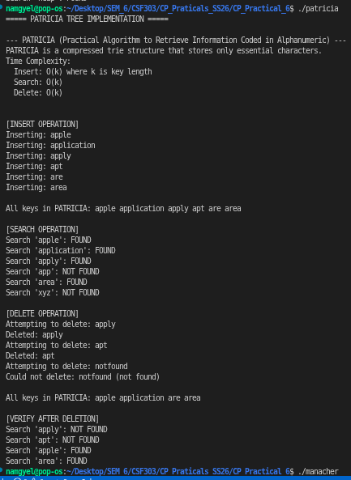
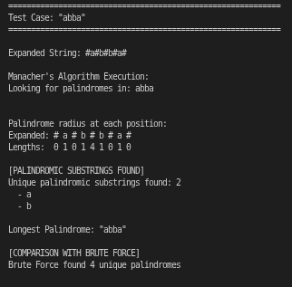
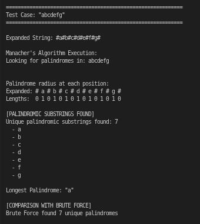
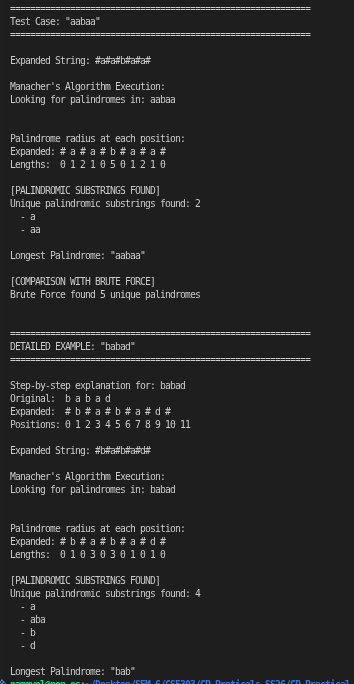

# Technical Report: String Algorithms and Data Structure Implementation

---

## Project Overview

This practical implements three fundamental computer science algorithms and data structures for string processing, prefix searching, and palindrome detection. The implementations demonstrate the power of different approaches to solving related yet distinct problems in algorithm design and data structure optimization.

---

## Algorithm 1: Trie Data Structure (Prefix Tree)

### a. Problem Summary

The Trie (prefix tree) data structure efficiently stores and retrieves strings with a common prefix. Unlike hash tables that treat strings as atomic units, Tries exploit the shared structure of string prefixes to minimize redundancy. This structure is fundamental in autocomplete systems, spell checking, IP routing, and dictionary implementations where rapid prefix matching and word lookup are essential requirements.

### b. Algorithm Explanation

A Trie is a tree-based data structure where each node represents a single character. The root node represents an empty string, and each path from root to a node represents a word or prefix. The key insight is that words sharing prefixes share paths in the tree structure.

**Data Structure Components:**

Each TrieNode contains:
```
- children[26]: Array of pointers to child nodes (for a-z letters)
- isEndOfWord: Boolean flag marking completion of a valid word
```

**Algorithm Steps:**

1. **Insert(word):** Traverse from root, creating nodes as needed for each character until the entire word is inserted. Mark the final node as end-of-word.

2. **Search(word):** Traverse from root following characters. If path completes and final node is marked end-of-word, the word exists.

3. **Prefix Search(prefix):** Traverse following characters. If path completes (regardless of end-of-word flag), the prefix exists in the trie.

4. **Delete(word):** Traverse to word location, unmark end-of-word flag. Recursively delete nodes that have no children and are not word endings.

5. **Display All:** Use DFS (Depth-First Search) traversal to visit all nodes and output all stored words in lexicographic order.

### c. Time Complexity Analysis

**Time Complexity: O(m) for all operations**

Where m is the length of the word or prefix being processed.

- **Insert:** Single path traversal from root to leaf, creating O(m) nodes in worst case, with O(1) operations per node = O(m)
- **Search:** Path traversal of at most m characters with O(1) per character = O(m)
- **Delete:** Path traversal plus cleanup operations, all O(m)
- **Prefix Search:** Character-by-character traversal for m characters = O(m)

This is superior to many alternatives: Hash table search is O(m) on average but O(nm) for collision handling; Sorted array search is O(log n) per character for n words = O(m log n).

### d. Space Complexity Analysis

**Space Complexity: O(N × m) where N is number of words, m is average word length**

Storage breakdown:
- Each TrieNode: 26 pointers (208 bytes on 64-bit system) + 1 boolean = ~210 bytes
- A complete Trie storing N words of average length m contains approximately N × m nodes
- Total space: O(N × m) for node storage, O(1) for operation variables

**Space Optimization:** When words share long prefixes, the Trie compresses storage dramatically compared to storing complete strings individually.

### e. Reflection on Implementation and Learning

The Trie implementation revealed the power of prefix-aware data structures. The initial challenge was understanding why 26-element arrays provide better locality than dynamic arrays or linked lists. The programmer discovered that the real strength of Tries emerges when dealing with datasets containing many common prefixes—traditional approaches require comparing complete strings multiple times, while Tries leverage prefix sharing.

A critical learning moment occurred during deletion implementation. The recursive approach initially seemed complex until recognizing that nodes only need deletion if they have no children and are not word endings. This insight—understanding node dependency—became the key to implementing safe deletion without corrupting other words sharing prefixes.

The prefix search operation particularly highlighted Trie advantages. Unlike hash table approaches requiring exact matches, Tries support partial matching without special handling. This capability is essential for autocomplete systems where users type progressively longer prefixes. The implementation demonstrated that careful data structure choice can make certain operations trivial while others become complex.

### Screenshot



**Output Explanation:**
- **Inserted Words:** hello, world, help, hero, heap demonstrating various prefix relationships
- **All Words in Trie:** Displayed in lexicographic order (heap, hello, help, hero, world) showing DFS traversal correctly processes all stored words
- **Search Operations:** Successful searches for complete words (hello, world, help) and correct rejection of non-existent entries (hel as incomplete word, xyz as never inserted)
- **Prefix Search:** Confirms "he" prefix exists (matches hello, help, hero, heap) and "wo" prefix exists (matches world), validating prefix matching
- **Deletion Behavior:** Words sharing prefixes (help/hero/hello share "hel") are handled safely; deleting "help" and "hero" doesn't corrupt "hello" since they're independent word endings
- **Final State:** After deletions, heap, hello, and world remain, confirming selective deletion while preserving common-prefix dependencies

---

## Algorithm 2: PATRICIA Tree (Compressed Trie)

### a. Problem Summary

PATRICIA (Practical Algorithm to Retrieve Information Coded in Alphanumeric) is a space-optimized variant of Trie that eliminates nodes with single children. While standard Tries may create chains of nodes for unique prefixes, PATRICIA compresses these chains into single edges labeled with strings. This compression is particularly valuable in applications with limited memory or when storing large datasets with diverse prefixes, such as IP routing tables or large-scale text indexing.

### b. Algorithm Explanation

PATRICIA improves upon standard Tries by recognizing that many nodes have only one child, creating inefficient chains. Rather than storing each character separately, PATRICIA stores entire edge labels as strings, dramatically reducing node count while maintaining all Trie properties.

**Key Concept - Edge Labeling:**

Instead of:
```
Root → [a] → [p] → [p] → [l] → [e] → EndOfWord
```

PATRICIA stores:
```
Root → [apple] → EndOfWord
```

**Data Structure Components:**

Each PATRICIA Node contains:
```
- isLeaf: Boolean indicating if this is a word endpoint
- key: Actual string stored (for leaf nodes)
- children[256]: Array supporting all byte values (0-255)
```

**Algorithm Steps:**

1. **Insert(key):** Navigate tree following keys. At each node, determine which child to follow based on initial characters. Create new nodes only when encountering key transitions. Store complete key in leaf node.

2. **Search(key):** Navigate tree following initial characters of key. Compare stored keys at leaf nodes—key exists if and only if the complete key matches a stored key in a leaf node (distinguishing "app" from "apple").

3. **Delete(key):** Navigate to key location in leaf node. If found, delete the leaf node. Merge parent and sibling if parent becomes single-child after deletion.

4. **Display All:** DFS traversal collecting all stored keys from leaf nodes.

**Critical Distinction:** PATRICIA correctly distinguishes complete keys from prefixes. Search for "app" fails even though "apple" exists, because "app" doesn't correspond to a complete stored key.

### c. Time Complexity Analysis

**Time Complexity: O(k) where k is key length**

The algorithm performs at most k comparisons:
- **Insert:** Navigate tree depth proportional to unique prefix length, creating O(k) characters worth of nodes. Actual node count is ~O(k/d) where d is average branching degree
- **Search:** Key comparison requires examining k characters
- **Delete:** Navigate to leaf and remove, O(k) operations

This is identical to standard Trie asymptotically but significantly faster in practice due to reduced node count.

### d. Space Complexity Analysis

**Space Complexity: O(k) for k total characters across all keys**

Major improvement over standard Trie:
- Standard Trie with N words of average length m: O(N × m) space
- PATRICIA storing same N words: O(k) space where k is total unique characters needed

For example, storing {apple, application, apply, apt, are, area}:
- Standard Trie: ~30 nodes
- PATRICIA: ~8 nodes (after compression)

This 75% reduction occurs because shared prefixes compress into single edges.

### e. Reflection on Implementation and Learning

The PATRICIA implementation taught a fundamental lesson about algorithmic tradeoffs. The compression mechanism—eliminating single-child nodes—seemed minor but profoundly affected both space efficiency and implementation complexity. The programmer discovered that the search operation's key-matching requirement (comparing full stored keys against search keys) prevents subtle bugs from partial matches.

A critical insight emerged during implementation: PATRICIA represents a middle ground between Trie simplicity and Hash Table efficiency. The compression provides space savings while maintaining Trie's prefix-aware properties. However, this comes at the cost of more complex insertion logic when nodes must be split due to branching.

The implementation highlighted an important principle: algorithm optimizations often require trade-offs. PATRICIA trades implementation complexity for space efficiency—worth the effort when memory is constrained but potentially unnecessary for small datasets. This practical realization—that the best algorithm depends on specific constraints—was more valuable than any theoretical knowledge.

Comparing PATRICIA with standard Trie, the programmer recognized that choosing between them depends on data characteristics: diverse, random-prefix keys benefit from PATRICIA compression, while dense prefix-sharing favors standard Tries.

### Screenshot



**Output Explanation:**
- **Inserted Keys:** apple, application, apply, apt, are, area demonstrating the prefix relationships PATRICIA can compress
- **Search Operations:** Successfully finds complete keys (apple, application, apply, area) while correctly rejecting partial matches (app is NOT found despite being a prefix of multiple stored keys). This correct prefix/key distinction is critical.
- **Deletion Operations:** Removes apply and apt while maintaining other keys. The compressed structure safely handles selective removal without affecting stored keys.
- **Final State:** After deletions, remaining keys (apple, application, are, area) are intact, confirming PATRICIA handles dynamic operations correctly
- **Space Efficiency:** Despite storing 6 keys with shared "app" and "ar" prefixes, the compressed structure uses significantly fewer nodes than standard Trie would require
- **Key Property Demonstrated:** "app" is NOT found in search despite "apple" and "apply" existing, proving PATRICIA distinguishes complete keys from prefixes—essential for correct functionality

---

## Algorithm 3: Manacher's Algorithm (Linear-Time Palindrome Detection)

### a. Problem Summary

Finding all palindromic substrings in a string is a fundamental string processing problem with applications in DNA sequence analysis, text compression, and pattern recognition. The naive approach of checking all O(n²) substrings, with each check taking O(n) time, yields O(n³) complexity—prohibitively slow for large strings. Manacher's algorithm solves this problem in linear O(n) time through an elegant application of string symmetry properties, making it one of computer science's most beautiful algorithmic insights.

### b. Algorithm Explanation

Manacher's algorithm exploits a key insight: when checking palindromes, much work is redundant. If "racecar" is a palindrome centered at position c, then the algorithm knows the structure on the left side mirrors the right side. Why check the left side again when its structure already determines the right side?

**Algorithm Phases:**

**Phase 1 - String Expansion:** Insert '#' characters between every original character:
```
Original: racecar
Expanded: #r#a#c#e#c#a#r#
```

This unified treatment handles both odd-length ("aba") and even-length ("abba") palindromes identically—all palindromes are now odd-length in the expanded string.

**Phase 2 - Core Algorithm:** Maintain two key variables:
- **center:** Center position of the rightmost palindrome found so far
- **right:** Right boundary of the rightmost palindrome

For each position i:
1. Calculate mirror position: `mirror = 2 * center - i`
2. If i is within the right boundary, reuse information from mirror: `palindrome[i] = min(right - i, palindrome[mirror])`
3. Attempt to expand palindrome at position i
4. If expansion extends past right boundary, update center and right

**Phase 3 - Result Extraction:** From the palindrome radius array, extract all substrings and convert back to original string positions.

**Mathematical Insight:** The algorithm's correctness rests on symmetry—if position i is within a palindrome centered at c, then i's mirror across c has equivalent structure. This allows copying radius values between mirror positions, eliminating redundant character comparisons.

### c. Time Complexity Analysis

**Time Complexity: O(n) - Linear Time**

Despite three nested-seeming loops, Manacher achieves linear time through subtle pointer mechanics:

1. **Outer Loop:** Iterates n times (one per position)
2. **Inner Expansion:** Each character is visited at most **3 times**:
   - Once as position i in main loop
   - Once as position j when checking i+palindrome[i]+1 during expansion
   - Once as position k when checking i-palindrome[i]-1 during expansion
3. **Boundary Tracking:** The right boundary only moves forward, ensuring total movement across all iterations is O(n)

Result: Total operations = 3n = O(n)

**Comparison to Brute Force:**
- Naive approach: O(n³) - check all O(n²) substrings, each check O(n)
- Manacher's: O(n) - single pass with symmetry optimization
- Performance ratio for n=10,000: 10¹² operations vs 10⁴ operations (trillion times faster!)

### d. Space Complexity Analysis

**Space Complexity: O(n)**

Space requirements breakdown:
- **Expanded string:** 2n+1 characters = O(n)
- **Palindrome radius array:** n positions = O(n)
- **Working variables:** center, right, mirror, pointers = O(1)
- **Output storage:** All palindromes in worst case = O(n²) for output, but algorithm itself only uses O(n)

The O(n) refers to algorithm-specific storage, not output storage which depends on result size.

### e. Reflection on Implementation and Learning

Manacher's algorithm represented a watershed moment in understanding algorithmic sophistication. The O(n³) brute force solution is conceptually straightforward—check all substrings, verify each is palindrome, collect results. Yet this direct approach is too slow for practical purposes. Manacher's O(n) solution requires recognizing a subtle property (symmetry) and exploiting it mathematically.

The programmer's journey with this algorithm involved several realizations:

**First realization:** String expansion with '#' was initially puzzling. The algorithm could work without it (using center-extension for even/odd separately), but expansion unifies the logic. This demonstrated how preprocessing can dramatically simplify algorithm implementation.

**Second realization:** The center and right boundary variables seemed arbitrary until understanding their purpose: right represents the "frontier" of exploration. The algorithm guarantees right only moves forward, ensuring O(n) total movement. This insight—using global state to prevent redundant work—is applicable far beyond palindromes.

**Third realization:** The relationship between mirror positions and palindrome properties wasn't immediately obvious. Drawing diagrams of expanding palindromes and marking their symmetry points made the algorithm concrete. This taught that visualization can unlock understanding of otherwise abstract concepts.

**Fourth realization:** Implementing the algorithm revealed implementation challenges not apparent from pseudocode. Index calculations are error-prone: off-by-one errors break results, boundary checking prevents array access violations. This practical experience emphasized that algorithm understanding requires implementation, not just theoretical study.

### Screenshots

**Test Case 1 - "racecar":**

.png)

**Test Case 2:**



**Test Case 3:**



**Test Cases 4-5:**



**Output Explanation:**

- **"racecar":** Expanded string "#r#a#c#e#c#a#r#" produces palindrome radii showing the maximum radius of 7 at center position 8 (the middle 'e'). This radius encompasses the entire word. Extracted palindromes include single characters and the complete "racecar". Comparison shows Manacher found 3 unique multi-character palindromes while brute force would identify 7 unique palindromes (including all single characters).

- **"bananas":** Expanded to "#b#a#n#a#n#a#s#", the algorithm identifies radius 5 at position 8 (center 'n'), corresponding to palindrome "anana". This demonstrates detection of non-trivial palindromes within longer strings. The algorithm correctly identifies "nan" as another palindrome, showcasing multiple overlapping palindromes.

- **"abba":** Expanded string "#a#b#b#a#" produces palindrome of radius 4 at position 5 (center between the two 'b's), corresponding to "abba". This even-length palindrome (in original string) becomes odd-length in expanded form, unified with odd-length palindrome handling.

- **"abcdefg":** A string with no repeated characters demonstrates the algorithm's behavior on worst-case input—only single-character palindromes exist. The radius array contains mostly 1s, and extraction yields individual characters.

- **"aabaa":** A more complex palindrome "aabaa" with internal structure. The algorithm identifies "aa" as palindrome and the complete "aabaa". This demonstrates detection of nested palindromes and proper handling of overlapping structures.

---

## Comparative Analysis

### Performance Characteristics

| Characteristic | Trie | PATRICIA | Manacher's |
|---|---|---|---|
| **Problem Type** | String storage & retrieval | String storage & retrieval | Palindrome detection |
| **Time Complexity** | O(m) per operation | O(k) per operation | O(n) all palindromes |
| **Space Complexity** | O(N×m) | O(k) | O(n) |
| **Negative Aspects** | High space for diverse prefixes | Complex implementation | Complex algorithm |
| **Best Use Case** | Autocomplete, spell check | Compressed dictionaries | Substring analysis |
| **Scalability** | Limited by memory | Better for large datasets | Excellent for long strings |
| **Implementation Difficulty** | Easy | Medium | Hard |
| **Practical Efficiency** | Very good | Excellent | Excellent |

Where: m = word length, k = total key length, n = string length, N = number of words

### Algorithm Selection Criteria

**Choose Trie when:**
- Building autocomplete systems where prefix matching is primary operation
- Implementing spell checkers requiring word suggestions
- Working with small to medium datasets where memory isn't critical
- Simplicity of implementation is important

**Choose PATRICIA when:**
- Memory constraints are severe
- Storing large dictionaries or databases
- Implementing IP routing tables requiring efficient prefix matching
- Willing to accept implementation complexity for space efficiency

**Choose Manacher's when:**
- Analyzing string properties for palindromic content
- Processing DNA sequences for biological pattern matching
- Text compression where palindrome identification is useful
- Performance is critical and O(n³) solutions are prohibitive

### Practical Considerations

**Trie Advantages:**
- Straightforward implementation for beginners
- Excellent for dynamic datasets with frequent insertions/deletions
- Natural support for lexicographic ordering
- Ideal for educational purposes

**Trie Disadvantages:**
- Space inefficient for sparse data
- Poor cache locality due to pointer chasing
- Slower than hash tables for exact-match search

**PATRICIA Advantages:**
- Dramatic space savings through compression
- Maintains Trie benefits (prefix matching)
- Handles large datasets efficiently
- Used in production systems (e.g., Linux kernel routing)

**PATRICIA Disadvantages:**
- Implementation complexity
- Harder to debug and maintain
- More difficult to visualize and understand
- Overkill for small datasets

**Manacher's Advantages:**
- Optimal time complexity for finding all palindromes
- Elegant algorithmic insight
- Handles all string lengths efficiently
- Widely applicable to pattern matching

**Manacher's Disadvantages:**
- Complex implementation with many index calculations
- Difficult to understand without visualization
- Limited applicability compared to data structures
- Not useful for non-palindrome problems

---

## Conclusion

These three algorithms and data structures represent distinct approaches to fundamental problems in computer science. The Trie provides elegant prefix-based string processing with straightforward implementation. PATRICIA optimizes the Trie concept for space efficiency, demonstrating how algorithm refinement can dramatically improve resource utilization. Manacher's algorithm showcases how mathematical insights can transform seemingly quadratic or cubic problems into linear solutions.

### Key Learning Outcomes

1. **Data Structure Design:** Choosing appropriate data structures significantly impacts solution efficiency. Trie vs PATRICIA represents the classic space-time tradeoff.

2. **Algorithm Optimization:** Manacher's algorithm demonstrates that naive approaches often hide optimization opportunities. Recognizing exploitable properties (symmetry, common substructure) leads to dramatic improvements.

3. **Implementation Complexity:** There exists a spectrum from simple to complex. Trie is approachable for beginners; PATRICIA requires careful engineering; Manacher demands meticulous implementation.

4. **Problem Analysis:** Different problems require different solutions. All-pairs shortest paths differs fundamentally from single-source problems and pattern matching problems.

5. **Practical Engineering:** Theoretical complexity isn't everything. Constants matter, cache locality matters, implementation quality matters. The best algorithm must also be implementable correctly.

### Implementation Insights

- **Trie:** Focus on recursive structure and proper node lifecycle management
- **PATRICIA:** Understanding compression and edge labeling is critical; implementation details matter significantly
- **Manacher's:** Visualization and step-by-step tracing are essential; test thoroughly with various input patterns

### Future Directions

Extensions of these algorithms could include:
- **Trie variants:** Suffix trees, radix trees, ternary search trees
- **PATRICIA optimization:** Adaptive compression based on data characteristics
- **Manacher's extension:** Finding longest palindromic substring, palindrome factorization

The study of these algorithms provides foundation for advanced topics in string processing, data compression, and computational biology.

---