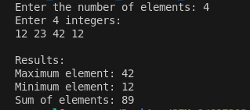

# Problem 1 — Dynamic Array Basics: Analysis

## Problem Summary
Read N integers, store them in a vector, and compute the maximum, minimum, and sum of all elements. This introduces dynamic array handling using C++ vectors.

## Algorithm Explanation
The program works in stages:

1. Read N (count of integers)
2. Create an empty vector and read N integers sequentially, adding each to the vector with `push_back()`
3. Find the maximum by comparing all elements, starting from the first element as initial max
4. Find the minimum by comparing all elements, starting from the first element as initial min
5. Calculate sum by iterating through all elements and accumulating their values
6. Display the three results

The approach avoids sentinel values (INT_MAX, INT_MIN) by using the first element as the starting point for max and min comparisons.

## Time Complexity Analysis
Each major operation requires iterating through the array:
- Input reading: O(N)
- Finding max: O(N)
- Finding min: O(N)
- Sum calculation: O(N)

**Overall: O(N)** - Despite multiple passes, the complexity remains linear since we perform constant multiples of N operations.

Could optimize to a single O(N) pass by computing max, min, and sum simultaneously, but the current approach is clear and the difference is negligible for practical purposes.

## Space Complexity Analysis
- Vector stores N integers: O(N)
- Auxiliary variables (max, min, sum, loop counters): O(1)

**Overall: O(N)** - Dominated by the vector storage.

## Reflection
This problem helped me understand how vectors work as dynamic containers for storing data. Initially I thought I had to use a fixed-size array and check for INT_MAX and INT_MIN for maximum and minimum values. But using the first element as the starting point made the code simpler and cleaner. The vector's `push_back()` function made it easy to add elements one by one without worrying about array size.

## Screenshot

Program execution with test input:

```
Enter the number of elements: 4
Enter 4 integers: 
12 23 42 12

Results:
Maximum element: 42
Minimum element: 12
Sum of elements: 89
```



The program successfully:
- Reads N=4 integers from user input
- Stores them in a vector using `push_back()`
- Finds maximum (42), minimum (12), and sum (89)
- Displays results correctly
