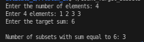

# Problem 10 — Count of Subsets with Sum Equal to Target: Analysis

## Problem Summary
Given an array of N integers and a target sum, count how many subsets have elements that sum exactly to the target. For example, with array [1, 2, 3, 3] and target 6, there are 3 subsets: [1, 2, 3], [1, 2, 3], and [3, 3].

## Algorithm Explanation
The solution uses Dynamic Programming (Tabulation) to count subsets with a target sum:

**Key Concept:**
Build a 2D DP table where `dp[i][j]` represents the number of subsets of the first i elements that sum to j. This avoids recalculating overlapping subproblems.

**Algorithm Steps:**

1. **Initialize DP table:**
   - Create 2D array `dp[n+1][target+1]`
   - Set `dp[0][0] = 1` (one way to get sum 0: empty subset)
   - All other values initialized to 0

2. **Fill the DP table:**
   - For each element i from 1 to n
   - For each sum j from 0 to target
   - Two cases:
     - **Exclude element:** `dp[i][j] = dp[i-1][j]`
     - **Include element (if j >= arr[i-1]):** `dp[i][j] += dp[i-1][j - arr[i-1]]`

3. **Return result:**
   - `dp[n][target]` contains the count of subsets with sum equal to target

**Example for arr=[1, 2, 3, 3], target=6:**

| i\j | 0 | 1 | 2 | 3 | 4 | 5 | 6 |
|-----|---|---|---|---|---|---|---|
| 0   | 1 | 0 | 0 | 0 | 0 | 0 | 0 |
| 1   | 1 | 1 | 0 | 0 | 0 | 0 | 0 |
| 2   | 1 | 1 | 1 | 1 | 0 | 0 | 0 |
| 3   | 1 | 1 | 1 | 2 | 1 | 1 | 1 |
| 4   | 1 | 1 | 1 | 3 | 1 | 1 | 3 |

Result: `dp[4][6] = 3` ✓

## Time Complexity Analysis
- Iterating through n elements: O(n)
- For each element, iterating through target sums: O(target)
- **Overall: O(n × target)** - polynomial time, much better than brute force O(2^n)

Each cell in the DP table is computed exactly once, making this efficient.

## Space Complexity Analysis
- 2D DP table: O(n × target)
- Input array: O(n)
- **Overall: O(n × target)** - due to the 2D table storage

Note: This can be optimized to O(target) using space optimization with two 1D arrays.

## Reflection
Initially, I thought about using recursion with memoization, which would also work but requires tracking the current index and sum (2D memo table). The tabulation approach is cleaner because we build the table bottom-up without recursion overhead. The key insight is that the problem has **optimal substructure**—the number of subsets with sum j using elements 0 to i depends on the number of subsets with sums j and j-arr[i] using elements 0 to i-1. This is a classic **coin change variant** problem. I learned that DP solves problems with overlapping subproblems exponentially faster than brute force. The transformation from thinking about "which elements to include" to "how many ways can we achieve each sum" is a powerful problem-solving technique.

## Screenshot

Program execution showing subset count with target sum:

The program correctly outputs 3 for input array [1, 2, 3, 3] and target sum 6, representing the subsets: [1, 2, 3], [1, 2, 3], and [3, 3].
