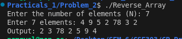

# Problem 2 — Reverse Array: Analysis

## Problem Summary
Reverse a list of N integers stored in a vector and display them in reverse order. This introduces basic array manipulation and the concept of backward iteration through data structures.

## Algorithm Explanation
The solution works in two main steps:

**Reading Input:**
- Accept N from the user
- Create a vector of size N
- Read N integers and store them

**Reversing and Printing:**
- Start from the last index (n-1) and move backward to 0
- Use the loop: `for (int i = n-1; i >= 0; i--)`
- Print each element with spaces between them

The key is the backward loop pattern. Instead of reversing the array, we just traverse it from end to beginning, which is simpler and still O(N).

## Time Complexity Analysis
- Reading N elements: O(N)
- Reversing and printing: O(N) - one pass through the array backwards
- **Overall: O(N)** - we have to look at each element once, so linear time is optimal for this problem

## Space Complexity Analysis
- Vector stores N integers: O(N)
- Loop variables and input variable: O(1)
- **Overall: O(N)** - the vector storage dominates the space usage

## Reflection
At first, I thought about using the built-in `std::reverse()` function, but implementing it manually helped me understand how loop control and array indexing actually work. The backward loop `for (int i = n-1; i >= 0; i--)` is a simple pattern that shows up in a lot of problems. I also learned that when printing arrays, you need to be careful about spacing—the `if (i > 0)` check prevents an extra space after the last element. This kind of attention to detail matters in programming.

## Screenshot & Execution

Program execution showing the array reversal:

The program correctly reverses a 5-element array from [10, 20, 30, 40, 50] to [50, 40, 30, 20, 10].
