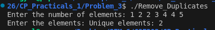

# Problem 3 — Remove Duplicates: Analysis

## Problem Summary
Given N integers (which may contain duplicates), remove all duplicates and print only the unique values in sorted order. This problem teaches how to use sorting to efficiently identify and eliminate duplicate elements.

## Algorithm Explanation
The solution uses sorting as the key strategy:

**Step 1: Read Input**
- Accept N from the user
- Create a vector and read N integers

**Step 2: Sort the Array**
- Use `std::sort()` to arrange elements in ascending order
- After sorting, duplicate elements will be adjacent to each other

**Step 3: Extract Unique Elements**
- Print the first element (always unique)
- Loop through the rest of the array
- Compare each element with the previous one using `arr[i] != arr[i-1]`
- Only print elements that are different from their predecessor

This approach is elegant because sorting groups duplicates together, making them easy to identify by simple comparison.

## Time Complexity Analysis
- Reading N elements: O(N)
- Sorting using std::sort: O(N log N) - this is the bottleneck
- Extracting and printing unique elements: O(N) - single pass through sorted array
- **Overall: O(N log N)** - dominated by the sorting step

The sorting step is necessary to group duplicates together, making it the limiting factor in time complexity.

## Space Complexity Analysis
- Vector storage for N integers: O(N)
- Temporary space used by sort algorithm: O(log N) to O(N) depending on implementation
- Loop variables and constants: O(1)
- **Overall: O(N)** - the vector dominates space usage

## Reflection
I initially thought about using a set data structure to automatically remove duplicates, but the hint suggested sorting instead. Using sorting taught me an important lesson: sometimes a simpler approach works better. By sorting first, adjacent duplicates become easy to identify with just a simple `!=` comparison. The std::sort function handles the heavy lifting efficiently with quicksort or introsort. I learned that preprocessing data (in this case, sorting) can make the main algorithm much simpler. This same pattern shows up in many problems like merging sorted arrays or finding intersections.

## Screenshot

Program execution showing duplicate removal:

The program correctly identifies and prints unique elements from [1, 2, 2, 3, 4, 4, 5] as [1, 2, 3, 4, 5].
