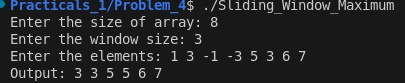

# Problem 4 — Sliding Window Maximum: Analysis

## Problem Summary
Given an array of N elements and a window size K, find the maximum element in every K-sized window as it slides through the array. This is a classic problem that demonstrates the power of the deque data structure for optimizing window-based algorithms.

## Algorithm Explanation
The solution uses a deque to track useful elements:

**Key Insight:**
Instead of storing elements themselves, store their indices. This lets us know which elements are in or out of the current window.

**Algorithm Steps:**

1. **Initialize deque with first window (i = 0 to K-1):**
   - For each element, remove smaller elements from the back (they can never be maximum while larger elements exist)
   - Add the current element's index to the back
   - The front of deque always has the index of maximum in current window

2. **Process remaining elements (i = K to N-1):**
   - Remove indices from front that are outside the window (index <= i - K)
   - Remove smaller elements from the back (maintain decreasing order)
   - Add current element's index to the back
   - Store the maximum (front element) in result

**Why This Works:**
The deque maintains indices in decreasing order of their values. By keeping only useful indices, we eliminate redundant comparisons. A larger element coming later makes all smaller elements before it irrelevant.

## Time Complexity Analysis
- First window processing: O(K)
- Remaining elements: O(N - K)
- Each element is added and removed from deque exactly once
- **Overall: O(N)** - linear time, much better than naive O(N*K) approach

The key efficiency comes from each index being pushed and popped at most once.

## Space Complexity Analysis
- Vector for input: O(N)
- Deque stores indices: O(K) at any given time (at most K elements)
- Result vector: O(N - K + 1)
- **Overall: O(N)** - dominated by input and output arrays

## Reflection
At first, I thought about using a simple approach: for each window, find the max by comparing all K elements. But that would be O(N*K) which is slow. Using a deque was a game-changer. The trick is storing indices instead of values—that way we know which elements are still in the window. The deque keeps elements in decreasing order, so the front always has the maximum. I learned that sometimes a better data structure (like deque) can reduce time complexity significantly. This pattern of maintaining a useful subset shows up in many problems like LRU cache, longest substring with unique characters, and more.

## Screenshot

Program execution showing sliding window maximum:

The program correctly finds the maximum in each window of size 3 from [1, 3, -1, -3, 5, 3, 6, 7] as [3, 3, 5, 5, 6, 7].
