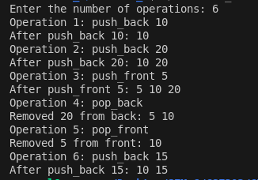

# Problem 5 — Balanced Line Problem: Analysis

## Problem Summary
Implement a system to manage a line where people can join from either end (front or back) and leave from either end. This demonstrates the deque data structure, which supports efficient operations on both ends, making it ideal for queue-like and stack-like behaviors simultaneously.

## Algorithm Explanation
The solution leverages the deque (double-ended queue) data structure:

**Operations Supported:**

1. **push_front(x)**: Add person with ID x at the front of the line
   - Uses deque's push_front() method
   - Time: O(1)

2. **push_back(x)**: Add person with ID x at the back of the line
   - Uses deque's push_back() method
   - Time: O(1)

3. **pop_front()**: Remove the person at the front of the line
   - Removes and returns the first element
   - Time: O(1)
   - Include error checking for empty line

4. **pop_back()**: Remove the person at the back of the line
   - Removes and returns the last element
   - Time: O(1)
   - Include error checking for empty line

**After each operation**, print the current contents of the line (or show error message if invalid).

**Key Insight:**
Unlike a vector, deque provides O(1) operations on both ends. This makes it superior to arrays or vectors where adding/removing from the front would be O(N).

## Time Complexity Analysis
- push_front: O(1) - amortized constant time
- push_back: O(1) - amortized constant time
- pop_front: O(1) - constant time
- pop_back: O(1) - constant time
- Printing deque: O(M) where M is current size of deque
- **For M operations: O(M)** - all operations are constant, only printing takes linear time

## Space Complexity Analysis
- Deque storage: O(M) where M is the number of elements currently in the line
- Temporary variables: O(1)
- **Overall: O(M)** - space depends on current line size

## Reflection
This problem taught me why deque is called "double-ended queue." I used to think vectors were good for everything, but adding elements at the front of a vector is O(N) because everything shifts. The deque solves this elegantly with O(1) operations on both ends. It's implemented using chunks of memory (not a single contiguous block like vector), which allows efficient growth on both sides. The error handling for empty line operations is also important—it prevents undefined behavior. I learned that choosing the right data structure can completely change performance characteristics of an algorithm.

## Screenshot

Program execution showing deque operations:

The program demonstrates all four operations with dynamic line management, showing the line state after each operation.
