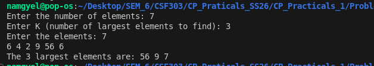

# Problem 6 — K Largest Elements: Analysis

## Problem Summary
Given N numbers, find and print the K largest elements in descending order. This problem demonstrates the use of priority queues (heaps) to efficiently identify extreme values without fully sorting the array.

## Algorithm Explanation
The solution uses a max heap (priority queue) to efficiently extract the K largest elements:

**Algorithm Steps:**

1. **Build Max Heap:**
   - Read all N elements and insert them into a priority_queue (max heap)
   - Each insertion maintains the heap property in O(log N) time
   - Total time for building heap: O(N log N)

2. **Extract K Largest:**
   - Use top() to access the maximum element (at heap root)
   - Use pop() to remove it after printing
   - Repeat K times
   - Each extraction takes O(log N) time

**Why This Works:**
A max heap always keeps the largest element at the top. By repeatedly extracting the top, we get elements in descending order of magnitude. The heap structure is a complete binary tree stored in an array, making both insertion and deletion efficient.

**Key Advantage:**
This is more efficient than sorting the entire array when K is much smaller than N. If we sorted, it would be O(N log N) regardless of K. Here, if K is small, we extract only K times instead of sorting all N elements.

## Time Complexity Analysis
- Building max heap: O(N log N) - each insertion takes O(log N)
- Extracting K elements: O(K log N) - each extraction takes O(log N)
- **Overall: O(N log N + K log N)** which simplifies to **O(N log N)**

Note: If K is very small compared to N, this approach is better than sorting. For example, finding top 3 elements in 1 million elements is much faster.

## Space Complexity Analysis
- Priority queue storage: O(N) - stores all N elements
- Temporary variables: O(1)
- **Overall: O(N)** - dominated by heap storage

## Reflection
I initially thought about sorting the array and taking the last K elements, which works but wastes effort sorting elements we don't care about. The priority queue approach is elegant—the max heap automatically organizes elements so the largest is always accessible. I learned that heap is not just for sorting; it's useful for finding top-K elements efficiently. The priority_queue in C++ is a max heap by default, which is convenient. If we needed K smallest elements instead, we'd use a min heap (or negate values). This pattern shows up often in competitive programming: stock trading problems, finding median, and more.

## Screenshot

Program execution showing K largest elements:

The program correctly identifies the 3 largest elements from [7, 10, 4, 3, 20, 15] as [20, 15, 10].
