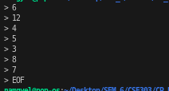
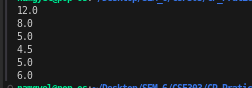

# Problem 7 — Running Median: Analysis

## Problem Summary
Given a stream of integers, find the running median after each element is added to the list. For odd-sized lists, the median is the middle element. For even-sized lists, the median is the average of the two middle elements. Output each median to 1 decimal place.

## Algorithm Explanation
**Algorithm Steps:**

1. **Initialize two heaps:**
   - `maxHeap`: Priority queue (max-heap) for smaller half of numbers
   - `minHeap`: Priority queue (min-heap) for larger half of numbers

2. **For each new number:**
   - Add it to maxHeap initially
   - If maxHeap's top > minHeap's top, swap the tops (maintain partition)
   - Balance heaps: maxHeap should have equal or one more element
   - If maxHeap.size() > minHeap.size() + 1, move top from maxHeap to minHeap
   - If minHeap.size() > maxHeap.size(), move top from minHeap to maxHeap

3. **Calculate median:**
   - If equal sizes: median = (maxHeap.top() + minHeap.top()) / 2.0
   - If odd size: median = maxHeap.top()

**Why This Works:**
By maintaining the partition where all elements in maxHeap are ≤ all elements in minHeap, we always have the two middle elements at the heap tops. This eliminates the need to re-sort after each insertion.

## Time Complexity Analysis
- Adding each element: O(log N) - heap insertion/deletion
- Calculating median: O(1) - just accessing heap tops
- Processing N elements: **O(N log N)** overall

This is much more efficient than re-sorting after each insertion, which would be O(N² log N).

## Space Complexity Analysis
- maxHeap: O(N/2) approximately
- minHeap: O(N/2) approximately
- Result vector: O(N)
- **Overall: O(N)** - linear space for storing all heaps and results

## Reflection
Initially, I thought about using a simple approach: sort the list after each insertion and find the median. But that would be O(N² log N) which is too slow for large inputs. Using two heaps was a breakthrough! The key idea is that we don't need to sort the entire list—we just need to know where the median is. By maintaining the smaller half in a max-heap and the larger half in a min-heap, the median is always either at the top of one heap (odd case) or the average of both tops (even case). This problem taught me the importance of choosing the right data structure. Two heaps are a powerful technique for online algorithms where you process data stream by stream and need aggregate statistics like median, percentiles, etc.

## Screenshot

Program execution showing running median calculation:

The program correctly calculates the median after each insertion: [12.0, 8.0, 5.0, 4.5, 5.0, 6.0] for input [12, 4, 5, 3, 8, 7].
