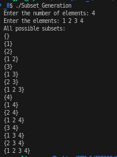

# Problem 8 — Subset Generation: Analysis

## Problem Summary
Generate all possible subsets (the power set) of N given numbers using the bitmask technique. A subset is any combination of elements from the original set, including the empty set and the full set. For N elements, there are exactly 2^N subsets.

## Algorithm Explanation
The solution uses a bitmask to represent each subset:

**Key Concept:**
Each subset can be represented by an N-bit binary number where bit i indicates whether the i-th element is included (1) or excluded (0).

**Algorithm Steps:**

1. **Generate all bitmasks:**
   - Total subsets = 2^N
   - Use bit shift: `1 << n` computes 2^N
   - Iterate mask from 0 to 2^N - 1

2. **For each bitmask:**
   - Check each bit position i from 0 to N-1
   - Use bitwise AND: `mask & (1 << i)` to check if bit i is set
   - If bit i is set, include arr[i] in the subset

3. **Print subsets:**
   - Format output as {element1 element2 ...}
   - Handle spacing correctly between elements

**Example for N=3, arr=[1,2,3]:**
- mask=0 (binary 000): {} - no bits set
- mask=1 (binary 001): {1} - bit 0 set
- mask=2 (binary 010): {2} - bit 1 set
- mask=3 (binary 011): {1 2} - bits 0,1 set
- mask=4 (binary 100): {3} - bit 2 set
- ... and so on

## Time Complexity Analysis
- Generating all bitmasks: 2^N iterations
- For each mask, checking N bits: O(N)
- **Overall: O(N × 2^N)** - we have exponential subsets, each taking linear time to process

This is optimal since we must generate all 2^N subsets anyway, and each has at most N elements to print.

## Space Complexity Analysis
- Input vector: O(N)
- Bitmask variable: O(1)
- Output printing: O(N) per subset (temporary space)
- **Overall: O(N)** - not counting the output

Note: If we stored all subsets in memory, it would be O(N × 2^N).

## Reflection
This problem really helped me understand the power of bitmasking! Initially, I thought about using recursion with backtracking (which also works), but the bitmask approach is much more elegant and easier to implement. Each bit position directly maps to whether an element should be included, making the logic straightforward. I learned that there are multiple ways to generate combinations—recursion, iteration, and bitmasking—each with their own advantages. Bitmasking is particularly useful when you need to represent subsets concisely and iterate through all possible combinations. The exponential nature of 2^N subsets is unavoidable since that's how many subsets actually exist, so O(N × 2^N) is optimal for this problem.

## Screenshot

Program execution showing subset generation:

The program correctly generates all 2^N subsets for a given input array using the bitmask technique.

## Reflection
The bitmask technique is elegant—it maps each subset to a number, which is clever. I initially thought about using recursion to generate subsets, but the bitmask approach is more direct and easier to understand. The key insight is that bit operations (AND, shift) are fast at the CPU level. Using `1 << i` instead of computing 2^i is a common optimization in competitive programming. I learned that sometimes a mathematical trick (like bitmask) can simplify a complex problem. This pattern shows up in many places: combinations, dynamic programming with state compression, and more. The bitmask method is particularly useful when dealing with small sets (N ≤ 20) where 2^N is manageable.

## Screenshot

Program execution showing subset generation:

The program correctly generates all 16 subsets (2^4) of [1, 2, 3, 4] in the order shown above.
