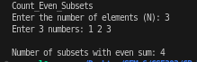

# Problem 9 — Count Subsets with Even Sum: Analysis

## Problem Summary
Given N numbers, count how many subsets (including the empty set) have an even sum. For the example with N=3 and array [1, 2, 3], there are 4 subsets with even sum: {}, {1, 3}, {2}, and {1, 2, 3}.

## Algorithm Explanation
The solution uses bitmasking to generate all subsets and checks which ones have even sum:

**Key Concept:**
Each subset can be represented by an N-bit binary number where bit i indicates whether the i-th element is included (1) or excluded (0). We generate all 2^N subsets and count those with even sum.

**Algorithm Steps:**

1. **Generate all bitmasks:**
   - Total subsets = 2^N
   - Use bit shift: `1 << n` computes 2^N
   - Iterate mask from 0 to 2^N - 1

2. **For each bitmask:**
   - Initialize sum = 0
   - Check each bit position i from 0 to N-1
   - Use bitwise AND: `mask & (1 << i)` to check if bit i is set
   - If bit i is set, add arr[i] to the sum

3. **Count even sums:**
   - Check if sum % 2 == 0 (even)
   - If yes, increment count
   - Return final count

**Example for N=3, arr=[1,2,3]:**
- mask=0 (binary 000): {} → sum=0 (even) ✓
- mask=1 (binary 001): {1} → sum=1 (odd) ✗
- mask=2 (binary 010): {2} → sum=2 (even) ✓
- mask=3 (binary 011): {1,2} → sum=3 (odd) ✗
- mask=4 (binary 100): {3} → sum=3 (odd) ✗
- mask=5 (binary 101): {1,3} → sum=4 (even) ✓
- mask=6 (binary 110): {2,3} → sum=5 (odd) ✗
- mask=7 (binary 111): {1,2,3} → sum=6 (even) ✓

**Result: 4 subsets with even sum**

## Time Complexity Analysis
- Generating all bitmasks: 2^N iterations
- For each mask, checking N bits: O(N)
- Calculating sum for each subset: O(N)
- **Overall: O(N × 2^N)** - exponential time, but optimal since we must generate all subsets

The time complexity is unavoidable because there are 2^N subsets to evaluate, and each takes O(N) time to compute.

## Space Complexity Analysis
- Input vector: O(N)
- Bitmask variable: O(1)
- Sum variable: O(1)
- Count variable: O(1)
- **Overall: O(N)** - not counting the output

The algorithm uses only constant extra space besides input storage.

## Reflection
This problem was a great reinforcement of bitmasking concepts! Initially, I thought about using recursion with backtracking to generate subsets, but bitmasking provides a cleaner, iterative approach. The key insight is that checking if a sum is even is simple (sum % 2 == 0), but we need to generate all 2^N subsets to evaluate them. I also learned that bitmasks directly map to subset generation—each bit position corresponds to including/excluding an element. The O(N × 2^N) complexity is exponential but unavoidable because the number of subsets itself is exponential. This problem demonstrates how bitmasking elegantly solves combinatorial problems by treating integers as binary representations of choices.

## Screenshot

Program execution showing count of even sum subsets:

The program correctly outputs 4 for input N=3 and array [1, 2, 3], representing the subsets: {}, {2}, {1,3}, and {1,2,3}.
