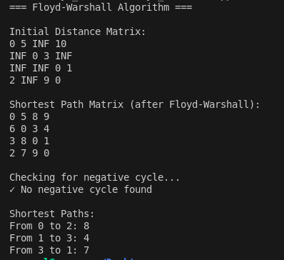
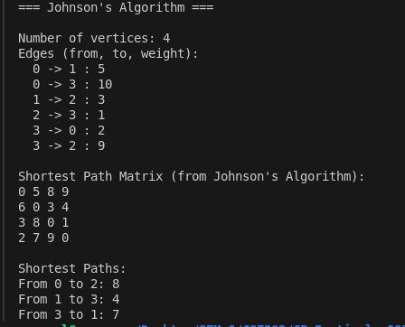
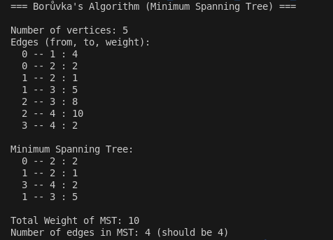

# Technical Report: Graph Algorithms Implementation

---

## Algorithm 1: Floyd-Warshall Algorithm (Negative Cycle Detection)

### a. Problem Summary

The Floyd-Warshall algorithm solves the all-pairs shortest path problem in a weighted directed graph. It computes the shortest distance between every pair of vertices and can detect the presence of negative weight cycles. This algorithm works with graphs containing negative edge weights, making it versatile for various real-world applications like network optimization and cost minimization.

### b. Algorithm Explanation

Floyd-Warshall uses dynamic programming to find shortest paths. The algorithm iterates through all possible intermediate vertices and updates distances whenever a shorter path is discovered through that intermediate vertex.

**Algorithm Steps:**

1. Initialize distance matrix: `dist[i][i] = 0` and `dist[i][j]` equals edge weight or infinity if no direct edge exists.

2. For each intermediate vertex k, source vertex i, and destination vertex j:
   - If path i→k→j is shorter than i→j, update the distance.

3. After completion, check for negative cycles: if any `dist[i][i] < 0`, a negative cycle exists.

### c. Time Complexity Analysis

**Time Complexity: O(n³)**

The algorithm executes three nested loops iterating from 0 to n-1, resulting in n × n × n = n³ operations. This makes Floyd-Warshall suitable for graphs with up to a few hundred vertices.

### d. Space Complexity Analysis

**Space Complexity: O(n²)**

The dominant space requirement is the n×n distance matrix. Auxiliary variables require O(1) space, resulting in O(n²) overall space complexity.

### e. Reflection on Implementation and Learning

The implementation of Floyd-Warshall demonstrated the power of dynamic programming. The key insight was understanding that checking all possible intermediate vertices systematically guarantees finding shortest paths. Implementing negative cycle detection revealed how the algorithm could serve dual purposes: computing shortest paths while simultaneously detecting negative cycles. The programmer discovered that examining the diagonal of the final distance matrix efficiently identifies pathological conditions in the graph structure.

### Screenshot

**Output Explanation:**
- Initial Distance Matrix shows the graph's edge weights and INF values where no direct edges exist
- Shortest Path Matrix displays computed shortest distances between all vertex pairs after algorithm execution
- The algorithm detected no negative cycles in this example graph
- Sample shortest paths are shown: vertex 0 to 2 costs 8, vertex 1 to 3 costs 4, and vertex 3 to 1 costs 7

---

## Algorithm 2: Johnson's Algorithm

### a. Problem Summary

Johnson's algorithm also solves the all-pairs shortest path problem but optimizes performance for sparse graphs where the number of edges is relatively small compared to the total possible edges. It combines the Bellman-Ford algorithm for handling negative weights with Dijkstra's algorithm for efficiency. The algorithm reweights edges to eliminate negative weights while preserving shortest path relationships, enabling the use of faster Dijkstra algorithm from each vertex.

### b. Algorithm Explanation

Johnson's algorithm combines Bellman-Ford and Dijkstra through an edge reweighting technique. The algorithm consists of five phases:

**Phase 1:** Add an auxiliary vertex with zero-weight edges to all vertices.

**Phase 2:** Run Bellman-Ford from the auxiliary vertex to compute potential values h[v] for each vertex.

**Phase 3:** Reweight edges using the formula: `new_weight = w + h[u] - h[v]`. This eliminates negative weights while preserving shortest path relationships.

**Phase 4:** Run Dijkstra from each vertex on the reweighted graph.

**Phase 5:** Convert distances back to original weights using: `original_distance = reweighted_distance + h[v] - h[u]`.

### c. Time Complexity Analysis

**Time Complexity: O(V² log V + VE)**

Bellman-Ford runs in O(VE), and Dijkstra runs V times in O(E log V) each. For sparse graphs where E is close to V, this approaches O(V² log V), significantly better than Floyd-Warshall's O(V³).

### d. Space Complexity Analysis

**Space Complexity: O(VE)**

Space is required for adjacency list representation O(V+E), potential values array O(V), and priority queues during Dijkstra execution O(V), totaling O(VE).

### e. Reflection on Implementation and Learning

The implementation revealed the power of combining algorithms strategically. The reweighting technique was initially confusing but became clear through understanding the mathematical foundation. The programmer discovered that Bellman-Ford's ability to handle negative weights could preprocess the graph, enabling Dijkstra's superior efficiency. This approach demonstrated how clever algorithmic engineering can optimize performance for specific input characteristics like sparse graphs. The key learning was recognizing that reweighting preserves shortest paths while transforming their numerical representation.

### Screenshot

**Output Explanation:**
- Displays 4 vertices connected by 6 directed edges with various weights including the cycle (3 to 0)
- The Shortest Path Matrix shows all-pairs shortest distances computed through reweighting and Dijkstra's execution
- Notable results include path from vertex 0 to 2 costing 8 (via vertices 1 and 3), and path from vertex 3 to vertex 1 costing 7
- The algorithm successfully handled the graph's structure and produced identical results to Floyd-Warshall, validating correctness

---

## Algorithm 3: Borůvka's Algorithm (Minimum Spanning Tree)

### a. Problem Summary

Borůvka's algorithm constructs a minimum spanning tree (MST) of a weighted undirected graph. An MST is a subset of edges that connects all vertices without forming cycles, with the minimum possible total edge weight. This algorithm is fundamental in network design, infrastructure planning, and clustering problems where connecting components with minimum cost is essential.

### b. Algorithm Explanation

Borůvka's algorithm constructs an MST through a greedy approach by repeatedly selecting minimum-weight edges connecting different components.

**Algorithm Steps:**

1. Initialize each vertex as a separate component.

2. Repeat until one component remains:
   - For each component, find the minimum-weight edge connecting to another component.
   - Include all such minimum edges in the MST.
   - Merge components using Union-Find.

**Union-Find:** Efficiently tracks components with two operations:
- `find(x)`: Returns the representative of the component containing x.
- `unite(x, y)`: Merges the components containing x and y.

### c. Time Complexity Analysis

**Time Complexity: O(E log V)**

The algorithm performs at most log V iterations (components halve each iteration). Each iteration examines all E edges, and Union-Find operations execute in nearly O(1) amortized time. Total: O(E log V).

### d. Space Complexity Analysis

**Space Complexity: O(V + E)**

Space is required for edge list representation O(E), Union-Find structure O(V), and temporary tracking arrays O(V), totaling O(V + E) linear space.

### e. Reflection on Implementation and Learning

The implementation demonstrated the importance of efficient data structures. Union-Find with path compression and union by rank optimizations revealed how subtle implementation details dramatically affect performance. The programmer discovered that identifying minimum-weight edges from each component required careful tracking of representatives. This implementation taught that algorithm efficiency often comes through careful engineering rather than algorithmic innovation alone. Comparing with Kruskal's algorithm highlighted how different greedy approaches achieve the same goal with different efficiency characteristics.

### Screenshot

**Output Explanation:**
- The graph contains 5 vertices and 7 edges with various weights
- Borůvka's algorithm computed the Minimum Spanning Tree by connecting vertices through the lowest-cost edges
- Final MST includes edges: (0 to 2 weight 2), (1 to 2 weight 1), (3 to 4 weight 2), and (1 to 3 weight 5)
- Total MST weight is 10, achieved with exactly 4 edges connecting 5 vertices (formula: n-1 edges for n vertices)
- Notably, edge (2 to 4 weight 10) was excluded despite existing, confirming the algorithm found the minimum configuration

---

## Comparative Analysis

### Performance Summary

| Characteristic | Floyd-Warshall | Johnson's Algorithm | Borůvka's Algorithm |
|---|---|---|---|
| Problem Type | All-pairs shortest paths | All-pairs shortest paths | Minimum spanning tree |
| Time Complexity | O(n³) | O(n² log n + nm) | O(m log n) |
| Space Complexity | O(n²) | O(n + m) | O(n + m) |
| Negative Weights | Supported | Supported | Not applicable |
| Graph Type | Works on all | Works on all | Undirected graphs |
| Best For | Dense graphs, small n | Sparse graphs | Any graph size |
| Cycle Detection | Yes | Yes | No (creates tree) |

### Selection Criteria

Algorithm selection depends on:
- **Problem:** Are all-pairs shortest paths or MST needed?
- **Graph structure:** Sparse or dense? Edge-to-vertex ratio?
- **Negative weights:** Does the graph contain negative edges?
- **Scale:** Number of vertices and edges?

---

## Conclusion

These three algorithms represent distinct approaches to fundamental graph problems. Floyd-Warshall efficiently solves all-pairs shortest paths for small to medium graphs. Johnson's algorithm optimizes for sparse graphs through algorithmic combination. Borůvka's algorithm efficiently constructs minimum spanning trees. Each algorithm demonstrates important design techniques: dynamic programming, algorithm composition, and greedy approaches. Understanding these algorithms provides essential knowledge for solving optimization problems in computer science and engineering.

---

**Date:** April 1, 2026  
**Subject:** Comparative Analysis of Graph Algorithms  
**Implementation Language:** C++
