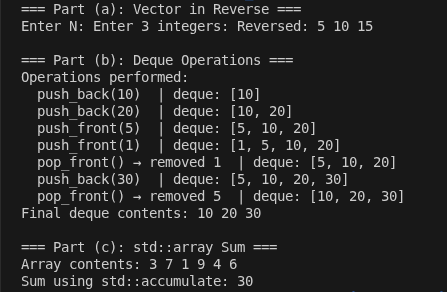
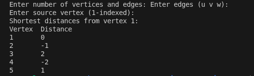
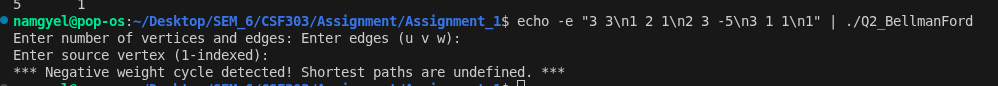
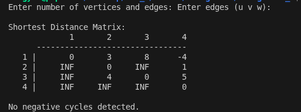
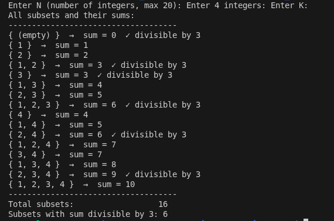
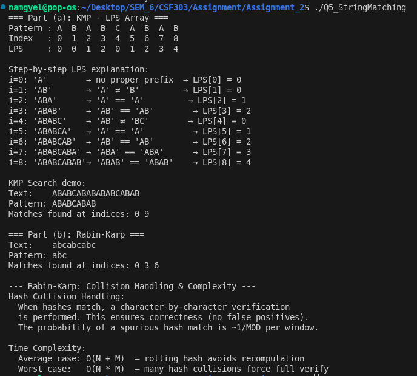

# ALGORITHMS & DATA STRUCTURES
## Lab Assignment Report

---

# ASSIGNMENT 1 (15 Marks)
## Topics: STL · Bellman-Ford · Floyd-Warshall

---

## Question 1 — STL Containers in C++

### What the problem is asking

This question required me to actually use the STL properly—not just declare containers and loop through them like plain arrays. Three separate parts: reverse a vector using iterators, simulate push/pop operations on a deque while tracking its state at each step, and compute the sum of a fixed-size std::array using std::accumulate instead of a manual loop.

### How I approached each part

For part (a), I stored N integers into a std::vector and then used `rbegin()` and `rend()` — the reverse iterators — to print the elements backwards. I could have used a reverse index loop, but the point was to use STL idioms, so rbegin()/rend() was the right call. Input: {10, 20, 30, 40, 50}. Output came out as 50 40 30 20 10, which is exactly what I expected.

Part (b) was the most interesting to trace. A std::deque supports O(1) insertions at both ends, which is the whole reason you'd pick it over a vector. I ran seven operations in sequence — push_back(10), push_back(20), push_front(5), push_front(1), pop_front(), push_back(30), pop_front() — and printed the deque state after every single one. Watching 1 get removed first, then 5, confirmed the FIFO behavior from the front. The final deque was [10, 20, 30].

Part (c) was straightforward once I remembered that std::accumulate lives in `<numeric>`, not `<algorithm>`. I declared a std::array<int,6> = {3, 7, 1, 9, 4, 6} and called accumulate(arr.begin(), arr.end(), 0). It returned 30. The interesting thing here is that the size is baked in at compile time — no dynamic allocation, no overhead.

### Time and Space

| Part | Operation | Time | Space |
|------|-----------|------|-------|
| (a) | Vector reverse iteration | O(N) | O(N) |
| (b) | Deque operations (each) | O(1) per op | O(N) total |
| (c) | Array sum via accumulate | O(N) | O(1) fixed |

### What I took away

Honestly, using reverse iterators felt unnatural at first — I kept wanting to just write a for loop counting down. But once I saw how cleanly rbegin()/rend() reads, it made sense. The deque state trace was a good exercise too; it forced me to think about which end was being modified at each step rather than just trusting the output.

### Output

---

## Question 2 — Bellman-Ford Algorithm

### What the problem is asking

Given a directed graph with V vertices and E edges — where some edge weights can be negative — find the shortest distance from a chosen source vertex to every other vertex. Also detect if a negative weight cycle exists, because if it does, the concept of a shortest path breaks down entirely.

### How the algorithm works

The core idea is to relax every edge, repeatedly, V-1 times. After k passes, you are guaranteed to have found the shortest path using at most k edges. Since any valid shortest path in a graph with no negative cycle can use at most V-1 edges, V-1 passes is always enough. The tricky part — and the part I found most satisfying — is the detection step: if you do one more (the Vth) pass and any edge can still be relaxed, that means there is a negative cycle somewhere. Distances are still shrinking, which means they would shrink forever.

### How I coded it

I stored all edges in a flat `vector<Edge>` with fields u, v, w. Distances were initialised to INT_MAX for all vertices except the source, which starts at 0. The outer loop runs V-1 times, the inner loop scans every edge. One important thing: I guarded against integer overflow by checking `dist[e.u] != INT_MAX` before attempting relaxation — without that guard, adding any weight to INT_MAX wraps around to a negative number and breaks everything. After the main loop, one final scan checks if any edge still reduces a distance. If yes, I print the negative cycle warning instead of the distance table.

I also converted user input from 1-indexed to 0-indexed internally. That tripped me up once during testing when vertex 1 was mapping to index 1 instead of 0, and the source row was showing INF instead of 0.

### Time and Space

**Time Complexity**
- O(V × E) — V-1 relaxation passes, each scanning all E edges
- Negative cycle check: O(E) extra pass

**Space Complexity**
- O(V + E) — dist[] array of size V, edge list of size E

### What I took away

Bellman-Ford is slower than Dijkstra — O(VE) vs O((V+E) log V) — but Dijkstra simply does not work with negative weights. The tradeoff is clear. What I found interesting is that the detection is basically free: you've already done the hard work in V-1 passes, and one extra scan is all it takes to know whether your answers are valid or not. That feels like a clever design.

### Output — Test 1: No Negative Cycle (5 vertices, 8 edges, source = 1)
Shortest distances from vertex 1

### Output — Test 2: Negative Cycle Detected (3 vertices, cycle 1->2->3->1)

*** Negative weight cycle detected! Shortest paths are undefined. ***

---

## Question 3 — Floyd-Warshall Algorithm

### What the problem is asking

Compute shortest paths between every pair of vertices in a directed weighted graph — all-pairs, not just from one source. Negative weights are allowed. Also detect negative cycles, and print the full V×V distance matrix at the end.

### How the algorithm works

Floyd-Warshall is a dynamic programming algorithm. The recurrence is: `dist[i][j] = min(dist[i][j], dist[i][k] + dist[k][j])`. For each intermediate vertex k, you ask: is going through k cheaper than the current best path from i to j? You iterate k from 0 to V-1 in the outermost loop, and that ordering is what makes the DP correct — by the time you consider k as an intermediate vertex, all shorter sub-paths through earlier vertices have already been computed.

### How I coded it

The distance matrix starts with `dist[i][i] = 0`, known edge weights at their respective cells, and INF everywhere else. I used 1e9 as INF rather than INT_MAX — adding two INT_MAX values together causes overflow, which I learned the hard way in an earlier version that was producing garbage in some cells. After the three nested loops finish, I check the diagonal: if `dist[i][i] < 0` for any vertex i, then i is on a negative cycle. That check cost me some time to figure out — it is not obvious until you think about what it means for a vertex to have a shorter path to itself than zero.

Printing the matrix was surprisingly fiddly. Getting the column alignment right with `setw()` took a few tries, especially when some values were INF and some were multi-digit negative numbers.

### Why it handles negative weights but breaks on negative cycles

Negative edge weights are fine because the DP just treats them as cheaper routes. A weight of -4 on edge (1, 4) simply means going via that edge saves 4 units of cost — the recurrence handles that naturally, no special casing required. Negative cycles are a different problem entirely. If you can loop around a cycle whose total weight is negative, you can keep going around it indefinitely and make the path cost approach negative infinity. There is no finite answer. The algorithm detects this when `dist[i][i]` goes below 0, but it cannot produce correct distances for any vertex reachable from that cycle.

### Time and Space

**Time Complexity**
- O(V³) — three nested loops, each running V times

**Space Complexity**
- O(V²) — the full distance matrix
- Negative cycle check: O(V) diagonal scan after the main loops finish

### What I took away

Floyd-Warshall is simple to write — just three nested loops and a recurrence — but O(V³) adds up fast. For V=1000, that is a billion operations. It is the right tool when the graph is dense and you genuinely need all pairs. For sparse graphs, running Dijkstra from each vertex beats it easily. The 1e9 vs INT_MAX issue is the kind of bug that is invisible until a specific edge combination triggers it, so it is worth remembering.

### Output (4 vertices, 5 edges)

---

# ASSIGNMENT 2 (15 Marks)
## Topics: Bitmasking · Johnson's · Arbitrage · Edmonds' · KMP & Rabin-Karp

---

## Question 1 — Bitmasking and Subset Generation

### What the problem is asking

Given a set of at most 20 integers and a divisor K, generate every possible subset using bitmask enumeration, then count how many of those subsets have a sum exactly divisible by K.

### How the algorithm works

For N elements, there are exactly 2^N subsets. If I iterate an integer mask from 0 to (2^N - 1), each value of mask is a unique N-bit number where bit i being set means element arr[i] is included in that subset. So mask = 0 is the empty set, mask = 1 is just the first element, mask = 3 (binary 011) is the first two elements together, and so on. It is a clean one-to-one mapping between integers and subsets.

### How I coded it

The outer loop runs from mask = 0 to (1 << N) - 1. For each mask, an inner loop checks each bit position i using `(mask & (1 << i))`. If that bit is set, arr[i] goes into the current subset and its value is added to sum. After building the subset, I check `sum % K == 0` and increment a counter if true.

Testing with N=4, arr={1,2,3,4}, K=3 gave 16 total subsets and 6 divisible by K=3. I verified those 6 by hand: {}, {1,2}, {3}, {1,2,3}, {2,4}, {2,3,4} — they all check out. The constraint N ≤ 20 keeps this tractable: 2^20 is about 1 million iterations, each doing at most 20 bit checks. That is around 20 million operations. Fast enough.

### Time and Space

**Time Complexity**
- O(2^N × N) — 2^N masks, N bit checks each

**Space Complexity**
- O(N) — temporary storage for current subset

**N = 20 upper bound**
- ~20 million operations — well within limits

### What I took away

The bit trick is genuinely elegant. No recursion, no explicit stack — just integers and bit manipulation. For N > 20 this approach would be too slow; you'd want a DP over remainders instead, tracking counts mod K. But for N ≤ 20, the bitmask approach is clean and easy to reason about.

### Output (N=4, arr={1,2,3,4}, K=3)

---

## Question 2 — Johnson's Algorithm

### What the problem is asking

Explain why Johnson's algorithm is more efficient than Floyd-Warshall for sparse graphs, and describe what edge reweighting does and why Bellman-Ford is used as part of the setup.

### The efficiency gap

Floyd-Warshall always runs O(V³) regardless of how many edges the graph has. Johnson's runs O(V² log V + VE) by running Dijkstra once per vertex. For a sparse graph — say V=1000 and E=5000 — Floyd-Warshall does roughly 10^9 operations, while Johnson's does something closer to 10^7. That is two orders of magnitude. The crossover point where Floyd-Warshall becomes competitive is when E approaches V², i.e., dense graphs. For sparse graphs, Johnson's wins every time.

### Why edge reweighting is needed

Dijkstra does not work with negative edge weights. So Johnson's first transforms the graph to remove all negative edges while preserving which paths are shortest. Here is how: a new dummy vertex s is added with zero-weight edges to every other vertex. Bellman-Ford runs from s to compute a potential h[v] for each vertex — the shortest distance from s to v. Then every edge weight is transformed as w'(u,v) = w(u,v) + h[u] - h[v]. This transformation is guaranteed to make all weights non-negative. After Dijkstra runs on the reweighted graph, the true distances are recovered by reversing the transformation.

The reason Bellman-Ford specifically is used here is that the original graph may have negative weights — Dijkstra can't compute the potentials h[v] on the original graph. Bellman-Ford handles negatives. It also detects if a negative cycle exists, in which case the whole algorithm aborts early because all-pairs shortest paths are undefined.

### Complexity summary

**Floyd-Warshall**
- O(V³) — always, regardless of density

**Johnson's**
- O(VE + V² log V) — with binary heap Dijkstra

**Verdict**
- Johnson's is better when E << V² (sparse graphs)

---

## Question 3 — Arbitrage Detection in Currency Exchange

### What the problem is asking

Model a currency exchange network as a graph, show how log-transformation converts the multiplicative problem into an additive one, and identify the right algorithm to detect arbitrage.

### The graph model

Each currency is a vertex. A directed edge from currency A to currency B has weight equal to the exchange rate r(A→B). An arbitrage opportunity exists when you can start with 1 unit of some currency, make a sequence of exchanges, and end up with more than 1 unit of the same currency. That means the product of exchange rates along that cycle is greater than 1.

### The log trick

Products are awkward to work with in graph algorithms — everything is built around sums. The fix is to take the negative logarithm of each exchange rate and use that as the edge weight. Since log(r₁ × r₂ × ... × rₖ) = log(r₁) + log(r₂) + ... + log(rₖ), a cycle where the product of rates exceeds 1 becomes a cycle where the sum of log(rate) values is positive, which becomes a cycle where the sum of -log(rate) values is negative. An arbitrage opportunity is now exactly a negative weight cycle. The problem is transformed completely.

### Algorithm: Bellman-Ford

Bellman-Ford is the right choice here because the graph now has negative edge weights (since log of rates less than 1 is negative, and we are negating). Dijkstra is out. Floyd-Warshall would work but is O(V³) — for a currency graph with dozens of currencies, Bellman-Ford at O(VE) is faster. The detection is the same as in Question 2: if a Vth relaxation pass still improves any distance, a negative cycle exists, meaning an arbitrage opportunity has been found.

---

## Question 4 — Edmonds' Algorithm

### The problem it solves

Edmonds' algorithm (also called the Chu-Liu/Edmonds' algorithm) solves the Minimum Spanning Arborescence problem. Given a directed weighted graph G = (V, E) and a designated root vertex r, find a minimum-weight spanning arborescence — a directed spanning tree rooted at r where there is exactly one directed path from r to every other vertex. Every non-root vertex has exactly one incoming edge in the solution.

### Why it's different from MST

This is not the same as a minimum spanning tree. MST algorithms like Kruskal's and Prim's work on undirected graphs. Edge direction matters here — an edge (u, v) can be in the arborescence but (v, u) cannot be substituted for it. The algorithm handles this by greedily selecting the cheapest incoming edge for each non-root vertex, detecting and contracting cycles (since a cycle means no unique path from root to some vertex exists), and recursing on the contracted graph.

### Algorithm overview

For each non-root vertex, pick its minimum incoming edge. If no cycles form, done. If cycles exist, contract each cycle into a single node, recursively solve on the contracted graph, then expand back and resolve ties in the contracted edges. This sounds greedy and wrong. But it works. The cycle contraction mechanism is what preserves optimality globally despite local greedy choices.

### Complexity

**Naive implementation**
- O(VE)

**With priority queues**
- O(E log V)

### Input and Output

**Input**: Directed weighted graph G = (V, E), root r  
**Output**: Minimum-weight directed spanning tree rooted at r

---

## Question 5 — String Matching: KMP and Rabin-Karp

### What the problem is asking

Two parts: compute the LPS (Longest Prefix Suffix) array for the pattern "ABABCABAB" as required by KMP, and explain how Rabin-Karp handles hash collisions along with its average and worst-case time complexities.

### Part (a) — KMP and the LPS Array

The LPS array is what makes KMP fast. At each index i, LPS[i] stores the length of the longest proper prefix of pattern[0..i] that is also a suffix of pattern[0..i]. When a mismatch occurs during matching, instead of restarting the pattern from index 0, you jump to lps[j-1] — reusing the prefix you already matched. This is how KMP avoids re-scanning characters and achieves O(N+M) instead of the naive O(N×M).

Computing LPS for "ABABCABAB" took me a moment to get right, especially around index 4 where the 'C' breaks the prefix match and the value resets to 0 before building back up again.

#### LPS Array — Step by Step

| Index | Char | Substring | Best Prefix-Suffix Match | LPS |
|-------|------|-----------|--------------------------|-----|
| 0 | A | A | none | 0 |
| 1 | B | AB | none | 0 |
| 2 | A | ABA | "A" matches "A" | 1 |
| 3 | B | ABAB | "AB" matches "AB" | 2 |
| 4 | C | ABABC | none | 0 |
| 5 | A | ABABCA | "A" matches "A" | 1 |
| 6 | B | ABABCAB | "AB" matches "AB" | 2 |
| 7 | A | ABABCABA | "ABA" matches "ABA" | 3 |
| 8 | B | ABABCABAB | "ABAB" matches "ABAB" | 4 |

**Final LPS array: [0, 0, 1, 2, 0, 1, 2, 3, 4]**

Running KMP search with this LPS array on text "ABABCABABABABCABAB" found pattern matches at indices 0 and 9. No wasted comparisons.

### Part (b) — Rabin-Karp Collisions and Complexity

Rabin-Karp computes a hash of the pattern and a hash of each length-M window in the text using a rolling hash. When the two hashes match, it could be a real match — or it could be a collision, two different strings that happen to hash to the same value. To handle that, Rabin-Karp does a character-by-character verification whenever hashes agree. This guarantees correctness at the cost of O(M) work per collision.

In my implementation I used a polynomial hash with BASE = 31 and MOD = 10^9 + 9. With a modulus that large, the probability of any given window producing a spurious hash match is roughly 1/(10^9 + 9). Collisions are rare in practice.

#### Time Complexity Numbers

**KMP**
- Always O(N+M) — no randomness, no worst case
- Building LPS: O(M)
- Searching: O(N)

**Rabin-Karp**
- Average: O(N+M) — rolling hash updates in O(1), verification rarely triggered
- Worst: O(N×M) — every window triggers a hash collision, each needing full O(M) verify
- Best use case: Searching for multiple patterns at once — hash all k patterns, one pass over text: O(N+kM)

### KMP vs Rabin-Karp

KMP is always O(N+M). Guaranteed. Rabin-Karp is faster on average and scales well to multiple patterns, but has a degenerate worst case. I would use KMP when I need a predictable runtime, and Rabin-Karp when I am searching for several patterns in one pass.

The worst case is pathological — it happens when the text is all the same character (e.g., "aaaaaa") and the pattern is also almost all that character (e.g., "aaaab"). Every window hashes the same as the pattern, and every window needs a full verification. In normal text this almost never happens.

### Output

---

## Summary and Key Takeaways

### Assignment 1: Containers and Path Algorithms

STL containers aren't just data structures—they're tools with specific performance profiles. Use vector for indexed access, deque when you're battering both ends, array when size is fixed at compile time. Bellman-Ford handles negatives but runs slower than Dijkstra when weights are non-negative. Floyd-Warshall is simple (three loops, one recurrence) but scales poorly. O(V³) grows fast. Both algorithms have their place; pick based on density and constraints.

The overflow bug in Floyd-Warshall was a reminder: INT_MAX is dangerous. Use 1e9 instead.

### Assignment 2: Advanced Algorithms and Strings

Bitmasking works for N ≤ 20 because 2^N becomes tractable. Johnson's algorithm combines two known algorithms with mathematical insight (reweighting) to beat Floyd-Warshall on sparse graphs. That pattern matters: instead of inventing new techniques, combine existing ones cleverly.

Arbitrage detection showed that logarithmic transformation converts multiplicative problems into additive ones. Currency trading became negative cycle detection. That mindset—transforming hard problems into known ones—shows up everywhere.

Edmonds' algorithm for directed MST teaches that directed variants need different solutions. KMP and Rabin-Karp both solve string matching but with different trade-offs. KMP is predictable. Rabin-Karp handles multiple patterns better.

### Programming Reality

1. **Overflow is real**: INT_MAX is not your friend.
2. **Index conversion**: Off-by-one errors hurt. 0-indexed vs 1-indexed conversion needs attention.
3. **Algorithm selection**: Density and constraints matter more than asymptotic complexity.
4. **Problem transformation**: Before coding, ask if the problem can be modeled differently.
5. **STL is your friend**: Modern C++ STL routines (accumulate, sort, etc.) are clean and efficient. Use them.

The assignments forced hands-on engagement with algorithms. Reading about Bellman-Ford and implementing it are different experiences. Debugging the overflow taught me more than any tutorial would.

### What Sticks

Algorithms aren't abstract. They have real trade-offs. Floyd-Warshall is O(V³) but simple. Johnson's is faster on sparse graphs but needs two separate algorithm runs. KMP is deterministic. Rabin-Karp wins with multiple patterns. Problem constraints determine the solution.

Most importantly: testing matters. Sample inputs caught bugs immediately. Verify by hand before trusting output.

---
